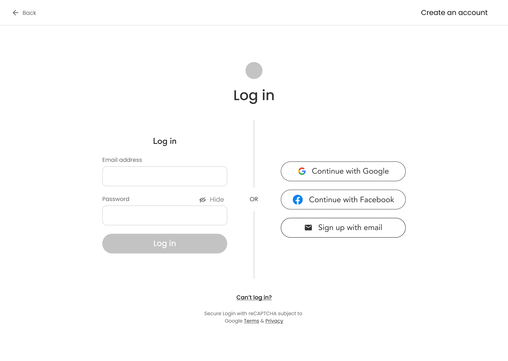

# ⚖️ LawEdge — CLAT PG Prep Portal

A modern, full-stack web application designed to help law students prepare for the **CLAT PG** (Common Law Admission Test - Postgraduate) entrance examination. Built with React, Node.js, Express, and MongoDB.



---

## ✨ Features

### 📚 Student Features
- **Dashboard** — Personalized welcome, study streaks, quick stats, and recent activity
- **YouTube Classes** — Curated video lectures organized by subject with progress tracking
- **PYQ Bank** — Previous Year Questions with filters by subject and year
- **Mock Tests** — Full NTA-style mock tests with timer, question palette, and instant scoring
- **Progress Tracker** — Visual charts and heatmaps to track study consistency
- **Bare Acts & Notes Vault** — Save and organize Google Drive links to legal documents
- **AI Legal Tutor** — Built-in AI chatbot powered by Google Gemini for instant doubt resolution
- **Profile Management** — Edit profile, upload avatar, and change password securely

### 🔐 Authentication
- Email & Password registration with validation
- Google Sign-In (OAuth 2.0)
- JWT-based session management
- Full-screen animated splash screen on login

### 🛡️ Admin Panel
- Manage Users (view, promote, delete)
- Manage Subjects, Videos, PYQs, and Mock Tests
- Role-based access control

### 🎨 Design & UX
- **Dark Mode** — System-wide toggle with localStorage persistence
- **Mobile Responsive** — Fully optimized for phones and tablets
- **Premium Animations** — Smooth transitions, micro-interactions, and hover effects
- **Modern UI** — Clean, glassmorphism-inspired design with Inter typography

---

## 🛠️ Tech Stack

| Layer      | Technology                          |
|------------|-------------------------------------|
| Frontend   | React 19, Vite, React Router v7    |
| Styling    | Vanilla CSS with CSS Custom Props   |
| Backend    | Node.js, Express.js                 |
| Database   | MongoDB with Mongoose               |
| Auth       | JWT, bcrypt, Google OAuth 2.0       |
| AI         | Google Gemini API                   |
| Charts     | Recharts                            |
| Deployment | Vercel (Frontend) + Render (Backend)|

---

## 📁 Project Structure

```
lawedge/
├── client/                    # React Frontend (Vite)
│   ├── public/                # Static assets (logo, favicon)
│   ├── src/
│   │   ├── components/        # Reusable components (Layout, SplashScreen, etc.)
│   │   ├── context/           # React Context (AuthContext)
│   │   ├── pages/             # Page components
│   │   │   └── admin/         # Admin panel pages
│   │   ├── styles/            # CSS files per component
│   │   └── utils/             # API client, constants
│   ├── .env.example           # Frontend env template
│   └── vercel.json            # Vercel SPA routing config
│
├── server/                    # Express Backend
│   ├── middleware/            # Auth & Admin middleware
│   ├── models/                # Mongoose schemas
│   ├── routes/                # API route handlers
│   ├── seeds/                 # Database seed scripts
│   └── .env.example           # Backend env template
│
└── .gitignore
```

---

## 🚀 Getting Started

### Prerequisites
- **Node.js** v18+
- **MongoDB** (local or [MongoDB Atlas](https://www.mongodb.com/atlas))
- **Google Cloud Console** project (for OAuth & Gemini API)

### 1. Clone the Repository
```bash
git clone https://github.com/Piyush-gour/lawedge.git
cd lawedge
```

### 2. Setup the Backend
```bash
cd server
npm install
cp .env.example .env
# Edit .env with your actual credentials
npm run dev
```

### 3. Setup the Frontend
```bash
cd client
npm install
cp .env.example .env
# Edit .env if needed
npm run dev
```

### 4. Open in Browser
Navigate to `http://localhost:5173`

---

## ⚙️ Environment Variables

### Frontend (`client/.env`)
```env
VITE_API_URL=http://localhost:5000/api
```

### Backend (`server/.env`)
```env
PORT=5000
MONGO_URI=mongodb://localhost:27017/clat-pg
JWT_SECRET=your_strong_random_jwt_secret
GOOGLE_CLIENT_ID=your_google_client_id
GEMINI_API_KEY=your_gemini_api_key
FRONTEND_URL=http://localhost:5173
```

---

## 🌐 Deployment

### Frontend → Vercel
1. Import repo on [vercel.com](https://vercel.com)
2. Set **Root Directory** to `client`
3. Set **Framework** to `Vite`
4. Add env: `VITE_API_URL` = your backend URL + `/api`

### Backend → Render
1. Create a **Web Service** on [render.com](https://render.com)
2. Set **Root Directory** to `server`
3. Set **Build Command** to `npm install`
4. Set **Start Command** to `node server.js`
5. Add all backend environment variables

---

## 📄 API Endpoints

| Method | Endpoint              | Description                |
|--------|-----------------------|----------------------------|
| POST   | `/api/auth/register`  | Register a new user        |
| POST   | `/api/auth/login`     | Login with email/password  |
| POST   | `/api/auth/google`    | Google OAuth login         |
| PUT    | `/api/auth/profile`   | Update user profile        |
| PUT    | `/api/auth/password`  | Change user password       |
| GET    | `/api/subjects`       | Get all subjects           |
| GET    | `/api/videos`         | Get all video lectures     |
| GET    | `/api/pyqs`           | Get previous year questions|
| GET    | `/api/tests`          | Get available mock tests   |
| GET    | `/api/documents`      | Get saved vault documents  |
| GET    | `/api/dashboard`      | Get dashboard stats        |
| POST   | `/api/chat`           | AI chat interaction        |
| GET    | `/api/news`           | Get legal news feed        |

---

## 🤝 Contributing

Contributions are welcome! Please feel free to submit a Pull Request.

---

## 📜 License

This project is open source and available under the [MIT License](LICENSE).

---

<p align="center">
  Built with ❤️ for CLAT PG aspirants
</p>
